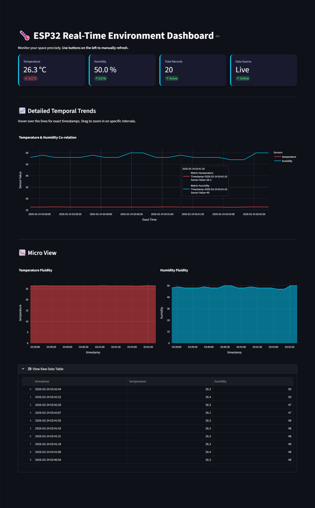
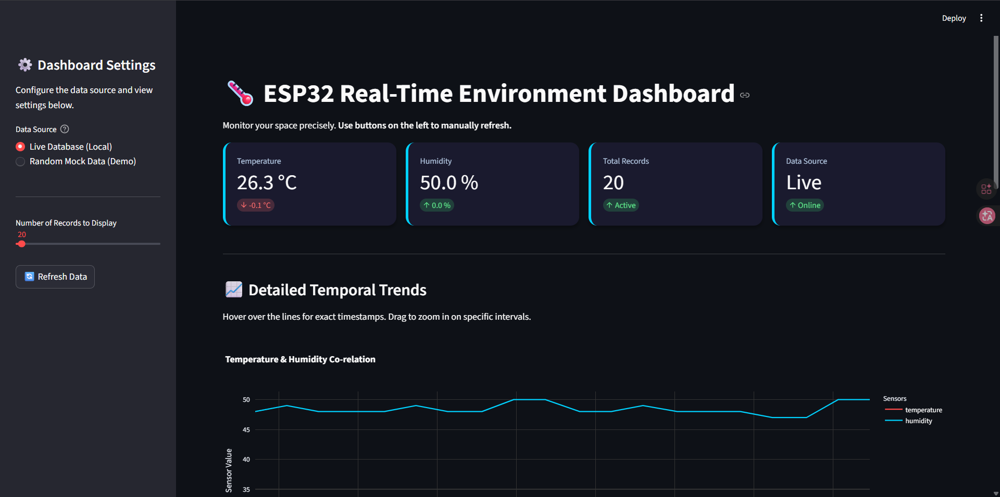
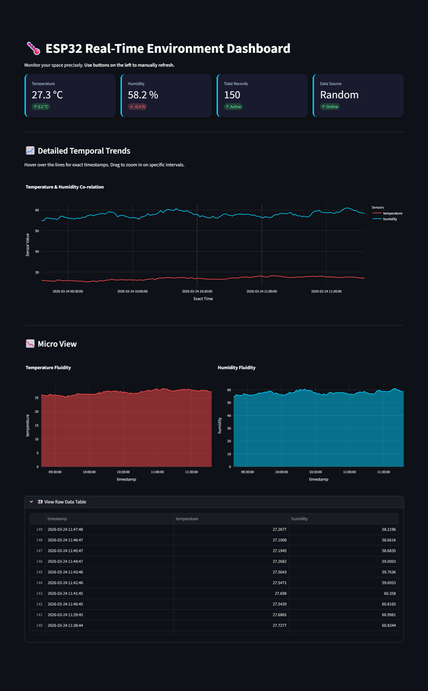
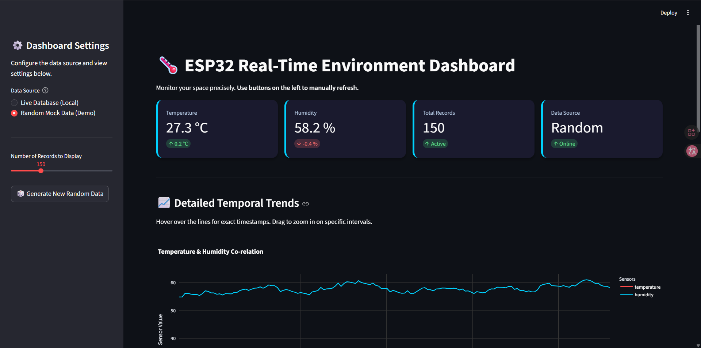

# IOT2026 ESP32 HW1
> 114-2 智慧物聯網 Arduino 系列課程 HW1

🐙 **GitHub Repository**：[coke5151/iot2026-esp32-hw1](https://github.com/coke5151/iot2026-esp32-hw1)  
🌍 **線上展示 (Public Demo)**：[https://iot2026-arduino-hw1-pytree.streamlit.app/](https://iot2026-arduino-hw1-pytree.streamlit.app/)  
> *(本專案的 Streamlit 儀表板已成功免費部署於官方的 Streamlit Community Cloud 服務上)*

聊天記錄請見[聊天記錄](./聊天記錄.md)

# Demo

🌍 **實機展示影片 (YouTube)**：[Watch Demo Video](https://youtu.be/hUg5mjioVz8?si=g2c-ctg7TzvIerPq)  
> *(本影片展示了實際硬體運作的情況：ESP32 開發板能夠即時抓取 DHT Sensor 的溫濕度資料，並成功更新到後端，最終即時且同步地反映在前端網頁上。)*

## Live 模式
> 在 Local 時透過 Wi-Fi 連接，讓板子將 DHT11 的資料送到後端。

<details>
<summary>點擊展開長截圖</summary>



</details>




## Random 模式
> 隨機生成測試資料

<details>
<summary>點擊展開長截圖</summary>



</details>




# 硬體配置
- ESP32 (ESP-WROOM-32)
- DHT11
- LED
- 按鈕

# 專案架構
- **edge**：ESP32 的專案程式碼，使用 PlatformIO 作為開發環境。
- **backend**：Python FastAPI 後端伺服器，負責接收感測器資料並儲存至 SQLite 資料庫。
- **frontend**：由 Streamlit 打造的即時互動式資料儀表板 (Dashboard)，主程式位於根目錄的 `app.py`。

# 如何執行專案

首先，請確保您已安裝了 [uv](https://github.com/astral-sh/uv) 作為 Python 專案管理工具。

## 1. 執行後端伺服器 (FastAPI Backend)

負責提供 ESP32 發佈感測器資料的 API 端點，並連接 SQLite 資料庫。

1. 切換至 `backend` 資料夾：
   ```bash
   cd backend
   ```
2. 執行伺服器主程式：
   ```bash
   uv run main.py
   ```
3. 成功啟動後，伺服器會運作在 `http://127.0.0.1:8000`。您可以打開網頁前往 [http://localhost:8000/docs](http://localhost:8000/docs) 來測試與查看自動生成的 API 文件。

## 2. 執行前端資料儀表板 (Streamlit Dashboard)

負責讀取 SQLite 中的歷史資料，並透過視覺化圖表展示即時的溫濕度趨勢。

1. 請確保終端機目前位於**專案根目錄** (就是有 `app.py` 與 `pyproject.toml` 的那一層)。
2. 使用 `uv` 執行 Streamlit 應用程式：
   ```bash
   uv run streamlit run app.py
   ```
3. 啟動後，系統通常會自動開啟您的瀏覽器並進入 Dashboard 頁面。如有需要，請手動前往 `http://localhost:8501`。

## 3. 部署硬體 (ESP32)

負責讀取溫濕度感測器數值，並透過 Wi-Fi 將資料發送至後端伺服器。

1. 在專案根目錄下，將 `.env.example` 檔案複製一份，並重新命名為 `.env`。
2. 開啟 `.env` 檔案，修改裡面的 Wi-Fi 名稱與密碼為您要讓板子連線的設定。**注意：** 屆時我們的後端伺服器與這張開發板必須處於**同一個區域網路 (LAN)** 之下。
3. 開啟 VSCode，並確保已安裝 PlatformIO 擴充套件。
4. 使用 VSCode 的「打開資料夾 (Open Folder...)」，將 `edge` 資料夾作為 Workspace 開啟。
5. 將 ESP32 透過 USB 線連接至電腦，使用 PlatformIO 的 Upload 按鈕將程式碼編譯並刷入至板子上。