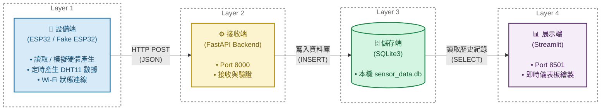
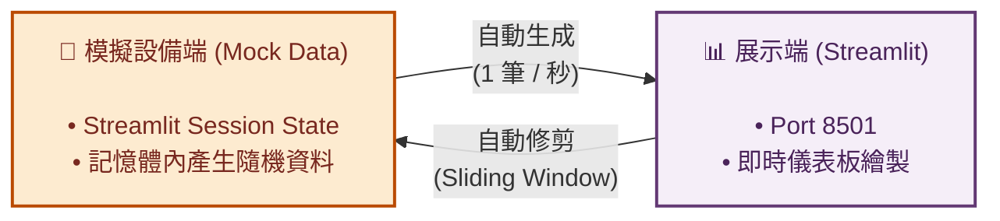

# IOT2026 ESP32 HW1

**Stack:** ESP32 (C++/PlatformIO) → FastAPI (Python) → SQLite3 → Streamlit

---

## 四層架構全景圖 (System Pipeline)

本系統的核心基於清晰的**四層架構**，分別負責資料的採集、接收驗證、持久化儲存與即時展示。此外，系統針對特定展示需求分為 **真實模式 (Live Mode)** 與 **模擬模式 (Random/Mock Mode)**。

### 1. 真實模式 (Live Mode)

遵循完整的四層資料流架構 (設備端 ➔ 接收端 ➔ 儲存端 ➔ 展示端)。



### 2. 模擬模式 (Random Mode)

專為無後端資料庫的雲端展示所設計，主要由「展示端」包辦模擬機制：



---

## 🔗 Links & References

1. **GitHub Repository:** [https://github.com/coke5151/iot2026-esp32-hw1/tree/andre]
2. **Live Demo (Streamlit Community Cloud):** [https://iot2026-arduino-hw1-pytree.streamlit.app/](https://iot2026-arduino-hw1-pytree.streamlit.app/)
3. **Development Log:** 請參考專案根目錄的 [`聊天記錄.md`](./聊天記錄.md) 以查看完整開發歷程。

---

## Step 1 — File Creation & Project Structure

專案分為 `edge` (ESP32)、`backend` (FastAPI) 與前端儀表板三大部分：

| Directory / File | Purpose |
|---|---|
| `edge/src/main.cpp` | ESP32 實體感測器程式 — 負責透過 WiFi 每 2 秒讀取 DHT11 感測器並將溫濕度 POST 給後端 |
| `backend/main.py` | FastAPI 伺服器 — 提供 REST API 接口接收 ESP32 上傳之歷史資料並寫入 SQLite |
| `app.py` | Streamlit 儀表板 — 視覺化整合平台，可切換「Live DB」與「Random」雙資料源 |
| `pyproject.toml` | 專案套件依賴 (透過 `uv` 管理) |
| `.env` | 儲存 WiFi SSID、Password 以及 Backend IP 等機密資訊 |

### `backend/main.py` — API Endpoints

| Method | Route | Description |
|---|---|---|
| POST | `/sensor-data` | 供 ESP32 將溫溼度 Payload 上傳儲存至 SQLite 資料庫 |
| GET | `/sensor-data` | 用於除錯，回傳目前資料庫內所有感測器紀錄 |
| GET | `/docs` | Swagger 自動生成的 API 測試與說明文件 |

### ESP32 Payload Format

```json
{
  "temperature": 25.4,
  "humidity": 60.1
}
```

---

## Step 2 — Dependency Installation

> **Note:** 本專案依循開發規範，全面捨棄 `pip`，改採 `uv` 進行極速套件管理。

**Command run:**

```powershell
uv add fastapi uvicorn streamlit psycopg2-binary plotly streamlit-autorefresh
```

核心套件列表：

- **fastapi, uvicorn**: 用於建置與運行非同步高效能後端。
- **streamlit**: 快速打造資料視覺化前端介面。
- **plotly**: 繪製具備高度互動性、科技感暗色系主題的趨勢圖形。
- **streamlit-autorefresh**: 實作 Dashboard 定時自動輪詢功能。

---

## Step 3 — Database Initialization & Schema

在 `backend/main.py` 中，透過 FastAPI 的 `@asynccontextmanager` 生命周期事件，在伺服器啟動時自動初始化 SQLite 資料庫。

**Table schema:**

```sql
CREATE TABLE IF NOT EXISTS sensor_data (
    id          INTEGER PRIMARY KEY AUTOINCREMENT,
    temperature REAL    NOT NULL,
    humidity    REAL    NOT NULL,
    timestamp   DATETIME DEFAULT CURRENT_TIMESTAMP
);
```

**DB 檔案位置:** `d:\iot2026-esp32-hw1\backend\sensor_data.db`

---

## Step 4 — Service Execution (How to Run)

### 1. 啟動 FastAPI 後端 (Live Database Gateway)

**Terminal 1:**

```powershell
cd backend
uv run main.py
```

> **Output:** 後端將會執行於 `http://127.0.0.1:8000`。透過前往 `/docs` 可進行簡易的連線除錯。

### 2. 前端儀表板 (Streamlit Dashboard)

**Terminal 2:**

```powershell
uv run streamlit run app.py
```

> **Output:** 啟動後瀏覽器會自動開啟 `http://localhost:8501`。

---

## Step 5 — Dashboard Validation ✅

Dashboard 具備雙重模式的資料驗證。

### Mode A: 實際 data (Live Database)

- **運作機制**: 透過 `@st.cache_data` 掛載，手動點擊或透過自動刷新功能定期向本地端的 SQLite (`sensor_data.db`) 提取最新溫濕度資料。
- **防呆機制**: 若尚未有 ESP32 的真機資料進入，畫面將以 `st.error` 給出明確警告 (`🚨 Error: Local Database Not Found or Empty!`)。
- **自動更新**: 頁面背景配置了每逢 **5 秒**自動更新的輪詢設定，完美映射真實世界的感測節奏且不傷硬碟。

<details>
<summary>點擊展開長截圖 (Live Mode)</summary>


</details>


### Mode B: 隨機測試資料 (Mock Data)

- **運作機制**: 專為雲端無部署資料庫狀態設計（如 Streamlit Community Cloud）。
- **資料產生**: 利用 `numpy.random.normal` 模擬逼真感測數據存留於記憶體 (Session State) 中。
- **自動更新與修剪**: 頁面配置 **每 1 秒** 自動推入一筆新資料，並實作「Sliding Window 自動修剪機制」，確保前端畫面擁有一秒一動的平滑折線滾動效果，且絕對不會耗盡伺服器記憶體空間。

<details>
<summary>點擊展開長截圖 (Random Mode)</summary>


</details>


---

## Final Summary

| Component | Status | URL |
|---|---|---|
| FastAPI Backend | ✅ Running locally | `http://localhost:8000` |
| Swagger UI | ✅ Verified | `http://localhost:8000/docs` |
| SQLite3 DB | ✅ Populating | `backend/sensor_data.db` |
| ESP32 Hardware | ✅ Active on WiFi | posts payload dynamically |
| Streamlit Live Mode | ✅ Running | `http://localhost:8501` (Interval: 5s) |
| Streamlit Mock Mode | ✅ Deployed | [Public Live Demo Link] (Interval: 1s) |

---

## Notes & Observations

1. **環境變數 (.env) 管理:** 為確保 ESP32 可以順利編譯並尋找到正確的 Router 與 Backend IP，專案中使用了 `apply_env.py` 作為 PlatformIO 的 pre-script。它會自動在編譯時從根目錄的 `.env` 中提取 `WIFI_SSID` 及 `BACKEND_IP` 作為 C++ 巨集。
2. **零成本雲端方案:** 本專案的前端儀表板非常適合以 Random Mode 免費部署於 Streamlit Community Cloud 上，藉此滿足外部參訪與非區網環境下的 Live Demo 動態展示需求。
3. **優異的使用者體驗:** 特別導入了 `plotly` 主題 (`plotly_dark`)，在前端提供高質感的數據檢索與縮放互動視覺體驗。
